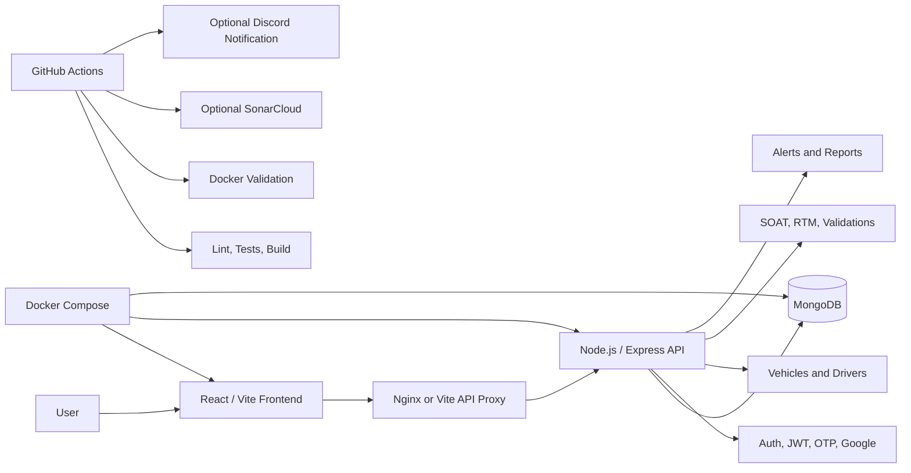

<div align="center">
<div align="center">


# DriveControl

### Fleet compliance, document tracking, and operational visibility in one platform.

**DriveControl helps fleet teams manage vehicles, drivers, SOAT, RTM, alerts, validation history, and compliance workflows before documents expire.**

</div>

---

## Table of Contents

- [Value Proposition](#value-proposition)
- [Problem](#problem)
- [Solution](#solution)
- [Target Users](#target-users)
- [Key Features](#key-features)
- [Current Scope](#current-scope)
- [Document Status Model](#document-status-model)
- [Architecture](#architecture)
- [Tech Stack](#tech-stack)
- [Quick Start With Docker](#quick-start-with-docker)
- [Local Development](#local-development)
- [Environment Variables](#environment-variables)
- [Data Persistence](#data-persistence)
- [Testing And Quality](#testing-and-quality)
- [CI/CD](#cicd)
- [SonarCloud Setup](#sonarcloud-setup)
- [Security Notes](#security-notes)
- [Project Structure](#project-structure)
- [Documentation](#documentation)
- [Visual Evidence](#visual-evidence)
- [Roadmap](#roadmap)
- [Team And Academic Origin](#team-and-academic-origin)

---

## Value Proposition

> DriveControl turns scattered fleet compliance work into a centralized, traceable, and actionable workflow.

Fleet teams often manage vehicle documents through spreadsheets, chats, folders, screenshots, and manual reminders. DriveControl helps reduce that operational friction by centralizing fleet records, document status, alerts, validation history, and account workflows in a single web platform.

The goal is simple: **fewer missed deadlines, better visibility, and faster decisions before compliance risks become operational problems.**

---

## Problem

Small and mid-sized fleet operations can lose visibility over critical information such as:

- Upcoming SOAT and RTM expiration dates.
- Driver and vehicle assignment records.
- License and document status.
- Evidence for internal audits or operational reviews.
- Manual reminders distributed across different tools.
- Authentication, recovery, and notification workflows.
- Repeatable deployment and quality verification.

When this information is not centralized, teams face a higher risk of expired documents, immobilizations, sanctions, duplicated work, and human error.

---

## Solution

DriveControl combines a **React/Vite frontend**, a **Node.js/Express API**, and **MongoDB persistence** to provide a fleet compliance platform focused on:

- Vehicle and driver management.
- SOAT and RTM document tracking.
- Preventive alerts.
- Operational dashboard.
- Simulated RUNT validation.
- Validation history.
- Reports and metrics.
- Secure authentication flows.
- Docker-based local execution.
- CI/CD quality checks.

Docker Compose starts the full stack locally with an internal MongoDB service. GitHub Actions validates frontend quality, backend tests, Docker health checks, optional DockerHub publishing, optional SonarCloud analysis, and optional Discord notifications.

---

## Target Users

DriveControl is designed for teams that need quick visibility and reliable document control:

- **Fleet managers** who need a general view of vehicle compliance.
- **Transport coordinators** responsible for daily operational follow-up.
- **Administrative staff** who manage SOAT, RTM, licenses, and supporting documents.
- **Operations teams** that need alerts before critical dates.
- **Small and mid-sized companies** that want to move away from manual spreadsheet-based tracking.

---

## Key Features

| Area | Feature | Status |
|---|---|---|
| Authentication | Register, login, JWT protected routes, recovery flows, OTP-oriented workflows. | Implemented |
| Google Authentication | Frontend and backend Google authentication configuration. | Implemented |
| User Profile | Profile management and email change workflow. | Implemented |
| Dashboard | Operational indicators, quick actions, recent vehicles, and recent alerts. | Implemented |
| Vehicles | Create, list, edit, delete, and assign drivers to vehicles. | Implemented |
| Drivers | Create, list, edit, and delete drivers with license status. | Implemented |
| Documents | Unified management for SOAT and RTM records. | Implemented |
| SOAT | Register, edit, delete, and calculate document status. | Implemented |
| RTM | Register, edit, delete, and calculate expiration status. | Implemented |
| Alerts | Consolidated alerts for documents, vehicles, and drivers. | Implemented |
| RUNT Validation | Simulated academic validation by plate or VIN. | Implemented |
| Validation History | Store, review, update notes, and delete validations. | Implemented |
| Reports | Operational metrics and document status analytics. | Implemented |
| Docker | Local stack with MongoDB, backend, and frontend. | Configured |
| CI/CD | GitHub Actions for validation, Docker, SonarCloud, and notifications. | Configured |
| Mobile UI | Responsive cards, scrollable modals, and mobile-friendly forms. | Improved |

> The RUNT validation is implemented as an academic simulation. This repository does not claim a real production integration with official RUNT services.

---

## Current Scope

The current verifiable scope includes:

- JWT authentication.
- Registration and login.
- Account recovery flows.
- OTP-oriented verification flows.
- Google authentication setup.
- User profile management.
- Vehicle CRUD.
- Driver CRUD.
- SOAT management.
- RTM management.
- Document status tracking.
- Alerts center.
- Operational dashboard.
- Reports and metrics.
- Simulated RUNT validation.
- Validation history.
- Theme and settings support.
- MongoDB persistence through backend API.
- Docker Compose stack.
- Frontend tests.
- Backend tests.
- Secret scanning helper.
- GitHub Actions pipelines.

---

## Document Status Model

DriveControl uses a simple traffic-light model to help teams prioritize action:

| Status | Meaning | Recommended Action |
|---|---|---|
| Green | The document is valid. | Continue normal monitoring. |
| Yellow | The document is close to expiring. | Schedule renewal before the deadline. |
| Red | The document is expired or critical. | Prioritize immediate action. |

This model helps users understand compliance risk without manually reviewing every expiration date.

---

## Architecture

DriveControl separates the user interface, API, and database layers.



The Docker frontend serves the Vite production build through Nginx on port `3000`. API requests under `/api` are proxied to the backend on port `5000`. In local Docker and CI, the backend uses the internal MongoDB service by default:

```txt
mongodb://mongodb:27017/logistica_db
```

---

## Tech Stack

| Layer | Technology |
|---|---|
| Frontend | React 18, Vite, Tailwind CSS, Vitest |
| Backend | Node.js 20, Express, Mongoose, Node test runner |
| Database | MongoDB 7 |
| Runtime | Docker, Docker Compose, Nginx |
| Quality | ESLint, Vitest coverage, backend tests, secret check script |
| CI/CD | GitHub Actions |
| Optional Quality Platform | SonarCloud |

---

## Quick Start With Docker

### Requirements

- Git.
- Docker Desktop or Docker Engine.
- Docker Compose.

### Clone

```sh
git clone https://github.com/Sarm-m/SYNTIXTECH.git
cd SYNTIXTECH
```

### Start the stack

Recommended Make flow:

```sh
make build
make up
```

Equivalent Docker Compose commands:

```sh
docker compose config
docker compose build
docker compose up -d
```

### Validate services

```sh
curl --fail http://localhost:5000/api/health/db
curl --fail http://localhost:3000/
curl --fail http://localhost:3000/api/health/db
curl --fail http://localhost:3000/api/health/auth
```

### Stop the stack

```sh
make down
```

Expected local endpoints:

| Service | URL | Description |
|---|---|---|
| Frontend | http://localhost:3000/ | Web application served by the frontend container. |
| Backend DB Health | http://localhost:5000/api/health/db | Direct backend/database health check. |
| Frontend API Proxy | http://localhost:3000/api/health/db | Health check through the frontend proxy. |

Use one runtime mode at a time. `make up` stops local npm/Vite processes before starting Docker, and `make dev` stops Docker before starting the local development servers.

```sh
make build
make up
make health
make ps
make logs
make down
make dev
```

---

## Local Development

Install dependencies:

```sh
npm --prefix apps/web ci
npm --prefix backend ci
```

Run local npm development mode:

```sh
make dev
```

This starts both backend and frontend through npm on `http://localhost:3000` after shutting down Docker containers for this project. It is an alternative development flow; the normal execution flow is `make build` followed by `make up`.

Run backend checks:

```sh
npm --prefix backend test
node --check backend/server.js
```

For non-Docker backend development, copy the example environment file and keep real values untracked:

```sh
cp backend/.env.example backend/.env
```

Do not commit real `.env` files.

---

## Environment Variables

Backend variables belong in the process environment, `backend/.env`, or a local root `.env`.

The backend must not depend on `apps/web/.env` for secrets.

Frontend variables must use the `VITE_*` prefix because Vite exposes them to browser code.

Common frontend variables:

```txt
VITE_API_URL=
VITE_GOOGLE_CLIENT_ID=
VITE_ENABLE_LOCAL_AUTH_FALLBACK=
```

Common backend variables:

```txt
NODE_ENV=
PORT=
MONGO_URI=
JWT_SECRET=
EMAIL_USER=
EMAIL_PASS=
GOOGLE_CLIENT_ID=
TWILIO_ACCOUNT_SID=
TWILIO_AUTH_TOKEN=
TWILIO_PHONE_NUMBER=
```

Use placeholders in example files only. Real values must be configured locally or through GitHub Actions secrets.

See:

- [docs/security/secrets-and-ci.md](docs/security/secrets-and-ci.md)
- [docs/environment.md](docs/environment.md)

---

## Data Persistence

Fleet entities are stored through the backend API in MongoDB and scoped by the authenticated user.

The main ownership field is:

```txt
ownerEmail
```

The backend uses the authenticated JWT to decide which records a user can access. Vehicles, drivers, SOAT records, RTM records, and validation history are loaded from API endpoints after login.

Browser storage is reserved for session data, theme, preferences, or an explicit development-only fallback. It must not be the main source of truth for fleet business data.

Manual persistence validation guide:

- [docs/testing/persistence-check.md](docs/testing/persistence-check.md)

---

## Testing And Quality

Run the main local validation commands:

```sh
npm --prefix apps/web run lint
npm --prefix apps/web test
npm --prefix apps/web run build
npm --prefix backend test
node --check backend/server.js
npm run secrets:check
git diff --check
```

The frontend test command writes coverage to:

```txt
apps/web/coverage/lcov.info
```

This file can be consumed by SonarCloud when SonarCloud is configured.

---

## CI/CD

Workflows live in:

```txt
.github/workflows/
```

Main workflows:

| Workflow | Purpose |
|---|---|
| `docker_ci_cd.yml` | Frontend/backend validation, Docker Compose validation, stack startup, and health checks. |
| `sonarcloud.yml` | Frontend quality checks and optional SonarCloud analysis. |
| `cd_entrega.yml` | Frontend artifact generation. |
| `notify_discord.yml` | Optional reusable Discord notification workflow. |
| `pipeline_hu454_auth_ci_cd.yml` | Authentication-focused validation and optional deploy hooks. |
| `quality_standards.yml` | Issue quality helper. |
| `kanban_flow_assignment.yml` | Issue workflow helper. |

Optional integrations skip with a GitHub notice when credentials are not configured. They should not fail the main validation path.

Optional GitHub Actions secrets:

```txt
DOCKERHUB_USERNAME
DOCKERHUB_TOKEN
SONAR_TOKEN
DISCORD_WEBHOOK_URL
BACKEND_DEPLOY_HOOK_URL
FRONTEND_DEPLOY_HOOK_URL
```

Optional GitHub Actions variables:

```txt
SONAR_ORGANIZATION
SONAR_PROJECT_KEY
```

---

## SonarCloud Setup

To enable SonarCloud in a personal repository:

1. Create or import the repository project in SonarCloud.
2. Configure this GitHub secret:

```txt
SONAR_TOKEN
```

3. Configure these GitHub repository variables:

```txt
SONAR_ORGANIZATION
SONAR_PROJECT_KEY
```

The repository should not be tied to the previous academic organization. SonarCloud organization and project key are provided through the workflow configuration.

---

## Security Notes

Real credentials must not be committed.

The repository ignores real environment files and private credential documents. Only example files with placeholders should be tracked.

Before pushing, run:

```sh
npm run secrets:check
git ls-files | grep -E '(^|/)\.env(\..*)?$|ANEXO_CREDENCIALES_PRIVADO.md'
```

If real credentials were ever pushed to GitHub history, rotate them in the original provider before continuing development. This includes:

- MongoDB Atlas credentials.
- Twilio tokens.
- Gmail or app passwords.
- Google OAuth secrets.
- DockerHub tokens.
- Discord webhooks.
- Deployment hooks.

After rotation, GitHub secret scanning alerts can be closed as revoked.

For history cleanup guidance, see:

- [docs/security/secrets-and-ci.md](docs/security/secrets-and-ci.md)

---

## Project Structure

```txt
.
├── apps/
│   └── web/
├── backend/
├── docs/
├── scripts/
├── .github/
│   └── workflows/
├── Dockerfile
├── Makefile
├── docker-compose.yml
├── docker-compose.prod.yml
├── package.json
├── sonar-project.properties
└── README.md
```

| Path | Description |
|---|---|
| `apps/web/` | React/Vite frontend, components, pages, hooks, contexts, services, tests, and frontend Dockerfile. |
| `backend/` | Node.js/Express API, services, scripts, and backend tests. |
| `docs/` | Architecture, QA, security, testing, agile evidence, and academic documentation. |
| `scripts/` | Repository utility scripts, including secret checks. |
| `.github/workflows/` | CI, CD, Docker, SonarCloud, and workflow automation. |
| `Dockerfile` | Backend image definition. |
| `apps/web/Dockerfile` | Frontend image definition using Vite build and Nginx. |
| `apps/web/nginx.conf` | Nginx configuration and `/api` proxy. |
| `docker-compose.yml` | Local stack with MongoDB, backend, and frontend. |
| `Makefile` | Helper commands for Docker build, startup, logs, status, and shutdown. |
| `sonar-project.properties` | SonarCloud source, test, coverage, and exclusion configuration. |

---

## Documentation

| Document | Description |
|---|---|
| [Secrets and CI configuration](docs/security/secrets-and-ci.md) | Safe secret handling, CI variables, and rotation guidance. |
| [Environment guide](docs/environment.md) | Local and Docker environment configuration. |
| [Persistence check](docs/testing/persistence-check.md) | Manual validation guide for MongoDB persistence. |
| [Architecture index](docs/Arquitectura/README.md) | Architecture documentation entry point. |
| [Design patterns matrix](docs/Arquitectura/patrones/matriz_patrones_gof.md) | Applied GoF patterns in the frontend. |
| [Database description](docs/DiagramaDB/syntix_tech_db_descripcion.md) | Database model description. |
| [Final QA evidence index](docs/QA/evidencias_finales/00_indice_sustentacion_5.md) | Final QA and validation evidence. |
| [Docker and CI/CD evidence](docs/QA/evidencias_finales/docker/04_despliegue_docker_ci_cd.md) | Docker and pipeline validation evidence. |
| [SonarCloud evidence](docs/QA/evidencias_finales/sonar/02_sonarcloud.md) | Quality metrics evidence. |
| [Data management](docs/data-management.md) | Data export, import, and operational validation documentation. |

---

## Visual Evidence

### Public Landing Page


### Operational Dashboard


### Vehicle Management


### Reports And Analytics


### Quality Metrics


### Authentication And Verification


### Docker Execution


### Tests And Quality


### Architecture And Data


---

## Roadmap

Planned improvements for continued product-oriented development:

- Add real MongoDB integration tests with local or in-memory MongoDB.
- Add Playwright tests for critical user flows and mobile layouts.
- Improve frontend code splitting to reduce large production chunks.
- Extract backend routes, controllers, services, and models from large files.
- Add company-level multi-tenant support.
- Add organization/admin roles.
- Add automated expiration notifications.
- Add PDF reporting workflows.
- Add backup and restore procedures.
- Add production observability and audit logs.
- Evaluate real external integrations only after security, contracts, and credentials are properly defined.

---

## Team And Academic Origin

DriveControl was created by **SYNTIX TECH** as an academic software engineering project at **Pontificia Universidad Javeriana**.

| Member | GitHub | Role |
|---|---|---|
| Sebastian Ramirez Maldonado | [@Sarm-m](https://github.com/Sarm-m) | Scrum Master |
| Samuel Freile | [@samuelfl680](https://github.com/samuelfl680) | Configuration Manager |
| Sebastian Rodriguez Ramirez | [@Juserora](https://github.com/Juserora) | Quality Assurance Lead |
| Solon Losada | [@solonlosada2006](https://github.com/solonlosada2006) | DevOps Engineer |
| Sebastian Vargas | [@juanvargax](https://github.com/juanvargax) | Product Owner and Sprint Planner |

Academic context:

| Field | Information |
|---|---|
| University | Pontificia Universidad Javeriana |
| Faculty | Engineering |
| Course | Fundamentos de Ingeniería de Software |
| Team | SYNTIX TECH |
| Original Project Name | DriveControl / AutoMinder Enterprise |
| Current Direction | Personal fork prepared for continued product-oriented development |

The repository keeps academic documentation and evidence under `docs/`, while the current personal fork is prepared for continued development as a more product-oriented SaaS platform.
