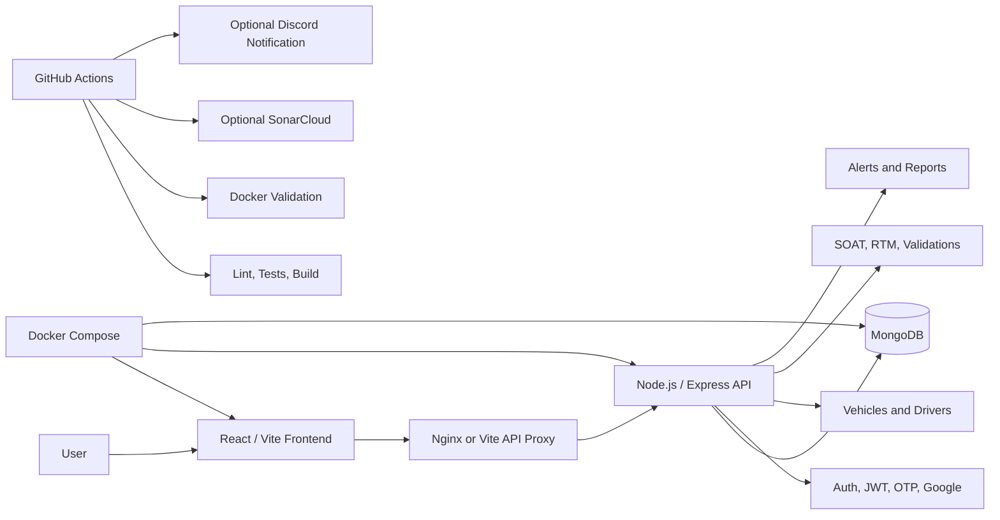

<div align="center">


# DriveControl

### Fleet compliance made simple.

**A web platform for managing fleet vehicles, drivers, SOAT, RTM, alerts, validation history, and operational compliance from one centralized dashboard.**

<br/>


</div>

---

## Table of Contents

* [Overview](#overview)
* [Problem](#problem)
* [Solution](#solution)
* [Key Features](#key-features)
* [Current Scope](#current-scope)
* [Document Status Model](#document-status-model)
* [Architecture](#architecture)
* [Tech Stack](#tech-stack)
* [Project Structure](#project-structure)
* [Environment Variables](#environment-variables)
* [Quick Start With Docker](#quick-start-with-docker)
* [Local Development](#local-development)
* [Common Commands](#common-commands)
* [Testing and Quality](#testing-and-quality)
* [Security Notes](#security-notes)
* [CI/CD](#cicd)
* [Documentation](#documentation)
* [Visual Evidence](#visual-evidence)
* [Roadmap](#roadmap)
* [Team and Academic Origin](#team-and-academic-origin)
* [License](#license)

---

## Overview

**DriveControl** is a fleet compliance platform designed to help operations teams centralize document tracking, vehicle records, driver records, expiration alerts, validation history, and account workflows.

The platform focuses on a common operational problem: many small and mid-sized fleets still manage critical documents through spreadsheets, chats, folders, screenshots, and manual reminders. DriveControl turns that scattered process into a clear dashboard with status signals, preventive alerts, traceable validations, and repeatable local/CI execution.

> **Goal:** fewer missed deadlines, better operational visibility, and faster decisions before compliance risks become expensive problems.

---

## Problem

Fleet teams can lose visibility over important operational information when documentation is handled manually or across disconnected tools.

Common issues include:

* SOAT and RTM expiration dates tracked in spreadsheets.
* Driver and vehicle assignment records distributed across chats or files.
* Manual reminders that depend on one person remembering each deadline.
* Limited auditability for internal reviews or compliance checks.
* Poor traceability when a document is edited, renewed, validated, or deleted.
* Higher risk of expired documents, immobilizations, sanctions, duplicated work, and operational downtime.

---

## Solution

DriveControl provides a centralized web platform for fleet compliance workflows.

It combines:

* A **React/Vite frontend** for the user interface.
* A **Node.js/Express backend** for API, authentication, validations, and business rules.
* **MongoDB persistence** for fleet records, users, documents, alerts, and validation history.
* **Docker Compose** for reproducible local execution.
* **GitHub Actions** for validation, quality checks, and CI workflows.

The platform helps teams manage vehicles, drivers, SOAT, RTM, preventive alerts, simulated RUNT validation, operational metrics, and account flows from one place.

> The RUNT validation included in this repository is an academic simulation for demonstration and testing. This repository does not claim a real production integration with official RUNT services.

---

## Key Features

| Area                  | Feature                                                                          | Status      |
| --------------------- | -------------------------------------------------------------------------------- | ----------- |
| Authentication        | Register, login, JWT protected routes, account recovery, and OTP-oriented flows. | Implemented |
| Google Authentication | Google OAuth configuration for frontend and backend authentication flows.        | Implemented |
| User Profile          | Profile management and account settings workflows.                               | Implemented |
| Dashboard             | Operational indicators, quick actions, recent vehicles, and recent alerts.       | Implemented |
| Vehicles              | Create, list, edit, delete, and assign drivers to vehicles.                      | Implemented |
| Drivers               | Create, list, edit, delete, and track driver license status.                     | Implemented |
| Documents             | Unified handling for SOAT and RTM records.                                       | Implemented |
| SOAT                  | Register, update, delete, and calculate document status.                         | Implemented |
| RTM                   | Register, update, delete, and calculate expiration status.                       | Implemented |
| Alerts                | Consolidated alerts for documents, vehicles, and drivers.                        | Implemented |
| Validation History    | Store, review, update notes, and delete validations.                             | Implemented |
| Reports               | Operational metrics and document status analytics.                               | Implemented |
| Mobile UI             | Responsive cards, scrollable modals, and mobile-friendly forms.                  | Improved    |
| Docker                | Local stack with MongoDB, backend, and frontend.                                 | Configured  |
| CI/CD                 | GitHub Actions for validation, Docker checks, SonarCloud, and notifications.     | Configured  |

---

## Current Scope

The current verifiable scope includes:

* JWT authentication.
* Registration and login.
* Account recovery flows.
* OTP-oriented verification flows.
* Google authentication setup.
* User profile management.
* Vehicle CRUD.
* Driver CRUD.
* SOAT management.
* RTM management.
* Document status tracking.
* Alerts center.
* Operational dashboard.
* Reports and metrics.
* Simulated RUNT validation.
* Validation history.
* Theme and settings support.
* MongoDB persistence through backend API.
* Docker Compose stack.
* Frontend tests.
* Backend tests.
* Secret scanning helper.
* GitHub Actions pipelines.

---

## Document Status Model

DriveControl uses a simple traffic-light model to help teams understand compliance risk quickly.

| Status | Meaning                              | Recommended Action                    |
| ------ | ------------------------------------ | ------------------------------------- |
| Green  | The document is valid.               | Continue normal monitoring.           |
| Yellow | The document is close to expiring.   | Schedule renewal before the deadline. |
| Red    | The document is expired or critical. | Prioritize immediate action.          |

This model allows users to prioritize actions without manually reviewing every date.

---

## Architecture

DriveControl separates the application into frontend, backend, and database layers.



By default, the frontend uses `/api` as the API base path. This allows Vite or Nginx to proxy API requests to the backend without mixing local frontend execution with an outdated backend service.

In Docker, the frontend is served on port `3000`, the backend runs on port `5000`, and MongoDB runs as an internal Compose service.

---

## Tech Stack

| Layer                     | Technology                                                            |
| ------------------------- | --------------------------------------------------------------------- |
| Frontend                  | React 18, Vite, Tailwind CSS, Lucide React, Vitest                    |
| Backend                   | Node.js, Express, Mongoose, JWT, Nodemailer, Twilio integration hooks |
| Database                  | MongoDB                                                               |
| Runtime                   | Docker, Docker Compose, Nginx                                         |
| Quality                   | ESLint, Vitest, backend tests, secret check script                    |
| CI/CD                     | GitHub Actions                                                        |
| Optional Quality Platform | SonarCloud                                                            |

---

## Project Structure

```txt
.
├── .github/
│   └── workflows/
├── apps/
│   └── web/
│       ├── src/
│       ├── public/
│       ├── Dockerfile
│       └── nginx.conf
├── backend/
│   ├── config/
│   ├── scripts/
│   ├── tests/
│   ├── package.json
│   └── server.js
├── docs/
│   ├── Arquitectura/
│   ├── DiagramaDB/
│   ├── Entrega-Final/
│   ├── QA/
│   ├── security/
│   └── testing/
├── scripts/
├── Dockerfile
├── Makefile
├── docker-compose.yml
├── docker-compose.prod.yml
├── package.json
├── sonar-project.properties
├── LICENSE
└── README.md
```

| Path                       | Description                                                                                        |
| -------------------------- | -------------------------------------------------------------------------------------------------- |
| `apps/web/`                | React/Vite frontend, pages, components, hooks, contexts, services, tests, and frontend Dockerfile. |
| `backend/`                 | Node.js/Express API, configuration, services, scripts, and backend tests.                          |
| `docs/`                    | Architecture, QA, security, testing, agile evidence, and academic documentation.                   |
| `scripts/`                 | Repository utility scripts, including secret checks.                                               |
| `.github/workflows/`       | CI, CD, Docker, SonarCloud, and workflow automation.                                               |
| `Dockerfile`               | Backend image definition.                                                                          |
| `apps/web/Dockerfile`      | Frontend image definition using Vite build and Nginx.                                              |
| `apps/web/nginx.conf`      | Nginx configuration and `/api` proxy.                                                              |
| `docker-compose.yml`       | Local stack with MongoDB, backend, and frontend.                                                   |
| `Makefile`                 | Helper commands for Docker build, startup, logs, status, and shutdown.                             |
| `sonar-project.properties` | SonarCloud source, test, coverage, and exclusion configuration.                                    |

---

## Environment Variables

Real environment files must never be committed.

Use the example files as templates:

| File                            | Purpose                                   |
| ------------------------------- | ----------------------------------------- |
| `.env.example`                  | Root-level environment template.          |
| `apps/web/.env.example`         | Frontend environment template.            |
| `apps/web/.env.local.example`   | Local frontend environment template.      |
| `backend/.env.example`          | Backend environment template.             |
| `backend/config/ci.env.example` | CI-oriented backend environment template. |

Backend variables belong in the process environment, `backend/.env`, or a local root `.env`.

The backend must not depend on `apps/web/.env` for secrets.

Frontend variables must use the `VITE_*` prefix because Vite exposes them to browser code.

### Common frontend variables

```txt
VITE_API_URL=/api
VITE_GOOGLE_CLIENT_ID=
VITE_ENABLE_LOCAL_AUTH_FALLBACK=
```

### Common backend variables

```txt
NODE_ENV=
PORT=
MONGO_URI=
JWT_SECRET=
EMAIL_USER=
EMAIL_PASS=
GOOGLE_CLIENT_ID=
TWILIO_ACCOUNT_SID=
TWILIO_AUTH_TOKEN=
TWILIO_PHONE_NUMBER=
```

Use placeholders in example files only. Real values must be configured locally, in Docker secrets, or through GitHub Actions secrets.

Related documentation:

* [Secrets and CI configuration](docs/security/secrets-and-ci.md)
* [Environment guide](docs/environment.md)

---

## Quick Start With Docker

### Requirements

* Git.
* Docker Desktop or Docker Engine.
* Docker Compose.
* Make, when using the Makefile commands.

### Clone

```sh
git clone https://github.com/Sarm-m/SYNTIXTECH.git
cd SYNTIXTECH
```

### Start the stack

Recommended Make flow:

```sh
make build
make up
```

Equivalent Docker Compose flow:

```sh
docker compose config
docker compose build
docker compose up -d
```

### Validate services

```sh
curl --fail http://localhost:5000/api/health/db
curl --fail http://localhost:3000/
curl --fail http://localhost:3000/api/health/db
curl --fail http://localhost:3000/api/health/auth
```

### Stop the stack

```sh
make down
```

### Expected local endpoints

| Service            | URL                                   | Description                                                  |
| ------------------ | ------------------------------------- | ------------------------------------------------------------ |
| Frontend           | http://localhost:3000/                | Web application served by the frontend container.            |
| Backend DB Health  | http://localhost:5000/api/health/db   | Direct backend/database health check.                        |
| Frontend API Proxy | http://localhost:3000/api/health/db   | Health check through the frontend proxy.                     |
| Auth Health        | http://localhost:3000/api/health/auth | Authentication configuration health check through the proxy. |

Use one runtime mode at a time. The Makefile is designed to avoid mixing Docker and local npm processes.

---

## Local Development

Install dependencies:

```sh
npm --prefix apps/web ci
npm --prefix backend ci
```

Run local npm development mode:

```sh
make dev
```

This starts both backend and frontend through npm on `http://localhost:3000` after shutting down Docker containers for this project.

For non-Docker backend development, copy the example environment file and keep real values untracked:

```sh
cp backend/.env.example backend/.env
```

Do not commit real `.env` files.

---

## Common Commands

| Command                           | Description                                           |
| --------------------------------- | ----------------------------------------------------- |
| `make build`                      | Build Docker images.                                  |
| `make up`                         | Start the Docker stack.                               |
| `make down`                       | Stop Docker services and clean the local stack.       |
| `make ps`                         | Show Docker Compose service status.                   |
| `make logs`                       | Show Docker Compose logs.                             |
| `make health`                     | Check backend, database, frontend, and proxy health.  |
| `make dev`                        | Stop Docker and start local npm development mode.     |
| `npm run secrets:check`           | Scan the repository for accidentally tracked secrets. |
| `npm run lint`                    | Run frontend lint checks.                             |
| `npm test`                        | Run backend and frontend tests from the root scripts. |
| `npm run build`                   | Build frontend production assets.                     |
| `npm --prefix backend test`       | Run backend tests.                                    |
| `npm --prefix apps/web test`      | Run frontend tests.                                   |
| `npm --prefix apps/web run build` | Build the frontend only.                              |
| `node --check backend/server.js`  | Validate backend server syntax.                       |

---

## Testing and Quality

Run the main local validation commands from the repository root:

```sh
npm run secrets:check
npm run lint
npm test
npm run build
git diff --check
```

Additional targeted checks:

```sh
npm --prefix apps/web run lint
npm --prefix apps/web test
npm --prefix apps/web run build
npm --prefix backend test
node --check backend/server.js
docker compose config
```

The frontend test command writes coverage to:

```txt
apps/web/coverage/lcov.info
```

This file can be consumed by SonarCloud when SonarCloud is configured.

Quality goals:

* Keep lint, tests, and build green before opening a pull request.
* Keep `.env` files untracked.
* Keep example environment files free of real credentials.
* Keep frontend and backend validation reproducible in CI.

---

## Security Notes

Real credentials must not be committed.

The repository is configured to ignore real environment files and private credential documents. Only example files with placeholders should be tracked.

Before pushing, run:

```sh
npm run secrets:check
git ls-files | grep -E '(^|/)\.env(\..*)?$|ANEXO_CREDENCIALES_PRIVADO.md'
```

If real credentials are ever pushed to GitHub, rotate them in the original provider before continuing development. This includes:

* MongoDB Atlas credentials.
* Twilio tokens.
* Gmail or app passwords.
* Google OAuth credentials.
* DockerHub tokens.
* Discord webhooks.
* Deployment hooks.

After rotation, GitHub secret scanning alerts should be closed as revoked.

For more details, see:

* [Secrets and CI configuration](docs/security/secrets-and-ci.md)

---

## CI/CD

Workflows live in:

```txt
.github/workflows/
```

Main workflows:

| Workflow                        | Purpose                                                                                   |
| ------------------------------- | ----------------------------------------------------------------------------------------- |
| `docker_ci_cd.yml`              | Frontend/backend validation, Docker Compose validation, stack startup, and health checks. |
| `sonarcloud.yml`                | Frontend quality checks and optional SonarCloud analysis.                                 |
| `cd_entrega.yml`                | Frontend artifact generation.                                                             |
| `notify_discord.yml`            | Optional reusable Discord notification workflow.                                          |
| `pipeline_hu454_auth_ci_cd.yml` | Authentication-focused validation and optional deploy hooks.                              |
| `quality_standards.yml`         | Issue quality helper.                                                                     |
| `kanban_flow_assignment.yml`    | Issue workflow helper.                                                                    |

Optional integrations should skip with a GitHub notice when credentials are not configured. They should not fail the main validation path.

Optional GitHub Actions secrets:

```txt
DOCKERHUB_USERNAME
DOCKERHUB_TOKEN
SONAR_TOKEN
DISCORD_WEBHOOK_URL
BACKEND_DEPLOY_HOOK_URL
FRONTEND_DEPLOY_HOOK_URL
```

Optional GitHub Actions variables:

```txt
SONAR_ORGANIZATION
SONAR_PROJECT_KEY
```

---

## SonarCloud Setup

To enable SonarCloud in a personal repository:

1. Create or import the repository project in SonarCloud.
2. Configure this GitHub secret:

```txt
SONAR_TOKEN
```

3. Configure these GitHub repository variables:

```txt
SONAR_ORGANIZATION
SONAR_PROJECT_KEY
```

The repository should not be tied to the previous academic organization. SonarCloud organization and project key are provided through the workflow configuration.

---

## Documentation

| Document                                                                                     | Description                                                    |
| -------------------------------------------------------------------------------------------- | -------------------------------------------------------------- |
| [Secrets and CI configuration](docs/security/secrets-and-ci.md)                              | Safe secret handling, CI variables, and rotation guidance.     |
| [Environment guide](docs/environment.md)                                                     | Local and Docker environment configuration.                    |
| [Persistence check](docs/testing/persistence-check.md)                                       | Manual validation guide for MongoDB persistence.               |
| [Architecture index](docs/Arquitectura/README.md)                                            | Architecture documentation entry point.                        |
| [Design patterns matrix](docs/Arquitectura/patrones/matriz_patrones_gof.md)                  | Applied GoF patterns in the frontend.                          |
| [Database description](docs/DiagramaDB/syntix_tech_db_descripcion.md)                        | Database model description.                                    |
| [Final QA evidence index](docs/QA/evidencias_finales/00_indice_sustentacion_5.md)            | Final QA and validation evidence.                              |
| [Docker and CI/CD evidence](docs/QA/evidencias_finales/docker/04_despliegue_docker_ci_cd.md) | Docker and pipeline validation evidence.                       |
| [SonarCloud evidence](docs/QA/evidencias_finales/sonar/02_sonarcloud.md)                     | Quality metrics evidence.                                      |
| [Data management](docs/data-management.md)                                                   | Data export, import, and operational validation documentation. |

---

## Visual Evidence

The following images are stored under `docs/Entrega-Final/evidencias/`.

### Public Landing Page


### Operational Dashboard


### Vehicle Management


### Reports and Analytics


### Quality Metrics


### Authentication and Verification


### Docker Execution


### Tests and Quality


### Architecture and Data


---

## Roadmap

Planned improvements for continued product-oriented development:

* Add real MongoDB integration tests with local or in-memory MongoDB.
* Add Playwright tests for critical user flows and mobile layouts.
* Improve frontend code splitting to reduce large production chunks.
* Extract backend routes, controllers, services, and models from large files.
* Add company-level multi-tenant support.
* Add organization/admin roles.
* Add automated expiration notifications.
* Add PDF reporting workflows.
* Add backup and restore procedures.
* Add production observability and audit logs.
* Evaluate real external integrations only after security, contracts, and credentials are properly defined.

---

## Team and Academic Origin

DriveControl was created by **SYNTIX TECH** as an academic software engineering project at **Pontificia Universidad Javeriana**.

| Member                      | GitHub                                                 | Role                             |
| --------------------------- | ------------------------------------------------------ | -------------------------------- |
| Sebastian Ramirez Maldonado | [@Sarm-m](https://github.com/Sarm-m)                   | Scrum Master                     |
| Samuel Freile               | [@samuelfl680](https://github.com/samuelfl680)         | Configuration Manager            |
| Sebastian Rodriguez Ramirez | [@Juserora](https://github.com/Juserora)               | Quality Assurance Lead           |
| Solon Losada                | [@solonlosada2006](https://github.com/solonlosada2006) | DevOps Engineer                  |
| Sebastian Vargas            | [@juanvargax](https://github.com/juanvargax)           | Product Owner and Sprint Planner |

Academic context:

| Field                 | Information                                                       |
| --------------------- | ----------------------------------------------------------------- |
| University            | Pontificia Universidad Javeriana                                  |
| Faculty               | Engineering                                                       |
| Course                | Fundamentos de Ingeniería de Software                             |
| Team                  | SYNTIX TECH                                                       |
| Original Project Name | DriveControl / AutoMinder Enterprise                              |
| Current Direction     | Personal fork prepared for continued product-oriented development |

The repository keeps academic documentation and evidence under `docs/`, while the current personal fork is prepared for continued development as a more product-oriented SaaS platform.

---

<div align="center">

**DriveControl**

</div>
