<div align="center">

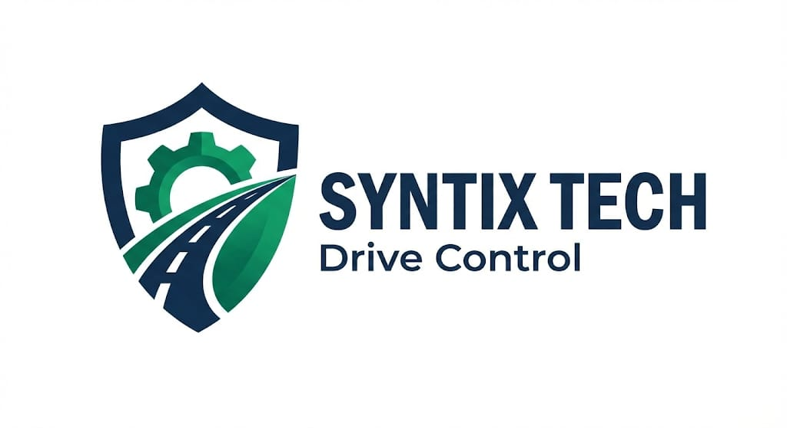

# DriveControl / AutoMinder Enterprise

### Blindaje operativo para flotas mediante cumplimiento documental

**Sistema web para la gestión inteligente de flotas, conductores, documentación vehicular, alertas preventivas y reportes de cumplimiento operativo.**

</div>

---

## 💡 Propuesta de valor

> Transformamos la gestión documental de flotas en una ventaja operativa, disminuyendo el riesgo de inmovilizaciones y multas mediante automatización del cumplimiento, visibilidad en tiempo real y alertas preventivas.

DriveControl / AutoMinder Enterprise ayuda a que la operación deje de reaccionar tarde frente a vencimientos y pase a trabajar con información centralizada, estados claros y evidencias verificables para la toma de decisiones.

---

## 👨‍💻 Equipo

| Miembro | GitHub | Rol |
|---|---|---|
| Sebastian Ramirez Maldonado | [@Sarm-m](https://github.com/Sarm-m) | Scrum Master |
| Samuel Freile | [@samuelfl680](https://github.com/samuelfl680) | Configuration Manager |
| Sebastian Rodriguez Ramirez | [@Juserora](https://github.com/Juserora) | Quality Assurance Lead |
| Solon Losada | [@solonlosada2006](https://github.com/solonlosada2006) | DevOps Engineer |
| Sebastian Vargas | [@juanvargax](https://github.com/juanvargax) | Product Owner y Sprint Planner |

Responsabilidades principales:

- **Scrum Master:** coordinación del proceso, seguimiento de acuerdos, evidencias y cierre académico.
- **Configuration Manager:** consistencia de configuración, ramas, trazabilidad y soporte documental.
- **Quality Assurance Lead:** validación funcional, pruebas, métricas y evidencias de calidad.
- **DevOps Engineer:** Docker, CI/CD, pipelines y validaciones reproducibles.
- **Product Owner y Sprint Planner:** priorización del valor, backlog, alcance funcional y guion de demostración.

Información académica:

- Equipo: SYNTIX TECH.
- Curso: Fundamentos de Ingeniería de Software.
- Universidad: Pontificia Universidad Javeriana.
- Proyecto: DriveControl / AutoMinder Enterprise.

---

## 📌 Tabla de contenido

- [👨‍💻 Equipo](#-equipo)
- [🎓 Información académica](#-información-académica)
- [📝 Descripción general](#-descripción-general)
- [⚠️ Problema identificado](#️-problema-identificado)
- [✅ Solución propuesta](#-solución-propuesta)
- [👥 Usuarios objetivo](#-usuarios-objetivo)
- [⭐ Diferenciación](#-diferenciación)
- [🚀 Alcance del sistema](#-alcance-del-sistema)
- [🚦 Semáforo documental](#-semáforo-documental)
- [🧭 Funcionalidades principales](#-funcionalidades-principales)
- [🏗️ Arquitectura general](#️-arquitectura-general)
- [🐳 Ejecución recomendada con Docker](#-ejecución-recomendada-con-docker)
- [🔐 Variables de entorno](#-variables-de-entorno-para-validación-académica)
- [💻 Ejecución local opcional](#-ejecución-local-opcional)
- [🎬 Guía rápida de demostración funcional](#-guía-rápida-de-demostración-funcional)
- [🧩 Patrones de diseño aplicados](#-patrones-de-diseño-aplicados)
- [🧪 Pruebas y calidad](#-pruebas-y-calidad)
- [⚙️ CI/CD y DevOps](#️-cicd-y-devops)
- [📁 Estructura del proyecto](#-estructura-del-proyecto)
- [📚 Documentación y evidencias](#-documentación-y-evidencias)
- [🖼️ Evidencias visuales del sistema](#️-evidencias-visuales-del-sistema)
- [🏁 Estado final del proyecto](#-estado-final-del-proyecto)

---

## 🎓 Información académica

| Campo | Información |
|---|---|
| Universidad | Pontificia Universidad Javeriana |
| Facultad | Ingeniería |
| Asignatura | Fundamentos de Ingeniería de Software |
| Proyecto | DriveControl / AutoMinder Enterprise |
| Equipo | SYNTIX TECH |
| Entrega | Sustentación final |
| Rama de trabajo | main |

---

## 📝 Descripción general

DriveControl / AutoMinder Enterprise es una aplicación web académica orientada a la administración del cumplimiento documental de una flota vehicular. El sistema permite centralizar información relacionada con:

- Vehículos.
- Conductores.
- Documentos vehiculares.
- SOAT.
- RTM.
- Alertas.
- Dashboard.
- Reportes.
- Validaciones.
- Cumplimiento documental.

La solución integra un **frontend React/Vite**, una **API Node.js/Express** y una **base de datos MongoDB**. Para la revisión docente, la ejecución recomendada se realiza con **Docker Compose**, usando la configuración preparada en el repositorio.

---

## ⚠️ Problema identificado

Muchas empresas que operan flotas vehiculares tienen dificultades para controlar los vencimientos y el estado documental de sus activos. La información suele quedar distribuida entre hojas de cálculo, archivos sueltos, correos, carpetas compartidas o registros manuales, lo que dificulta mantener trazabilidad sobre SOAT, RTM, licencias, conductores, vehículos y evidencia documental.

Las consecuencias principales son:

- Riesgo de sanciones e inmovilizaciones.
- Vehículos circulando con documentos vencidos.
- Falta de trazabilidad documental.
- Gestión manual en archivos dispersos.
- Pérdida de tiempo operativo.
- Errores humanos en seguimiento de fechas críticas.

---

## ✅ Solución propuesta

El sistema propone una plataforma web que centraliza la gestión de flota y facilita el seguimiento del cumplimiento documental. Desde la aplicación se pueden registrar vehículos, registrar conductores, gestionar documentos, consultar alertas, revisar dashboard, consultar reportes, validar el estado general de la flota y mejorar la trazabilidad de SOAT, RTM y licencias.

La solución está alineada con la sustentación académica porque presenta un problema operativo concreto, una respuesta tecnológica verificable, evidencias de arquitectura, pruebas automatizadas, patrones de diseño, DevOps y una guía de demostración funcional reproducible.

---

## 👥 Usuarios objetivo

DriveControl está orientado a actores que necesitan visibilidad rápida y control documental confiable:

- **Gerentes de logística**, que requieren una vista ejecutiva del estado de la flota.
- **Coordinadores de transporte**, responsables de seguimiento operativo diario.
- **Personal administrativo**, encargado de cumplimiento documental y renovación de soportes.
- **Conductores o actores asociados a la operación**, que dependen de información vigente para circular.
- **Equipos de control de flota**, responsables de SOAT, RTM, licencias, vehículos y alertas.

---

## ⭐ Diferenciación

DriveControl no es solo una lista de vehículos. Es una plataforma académica funcional que combina:

- **Centralización documental** de vehículos, conductores, SOAT y RTM.
- **Alertas preventivas** para anticipar vencimientos.
- **Dashboard y reportes** para lectura ejecutiva del estado operativo.
- **Validación RUNT simulada** para contrastar datos dentro del alcance académico.
- **Docker** para despliegue reproducible en revisión docente.
- **Pruebas y calidad** con comandos verificables y evidencias visuales.
- **Patrones de diseño** aplicados en módulos reales del frontend.

---

## 🚀 Alcance del sistema

El alcance actual verificable del sistema incluye:

- Autenticación con JWT.
- Registro, inicio de sesión, recuperación de cuenta y verificación OTP.
- Autenticación con Google configurada en frontend y backend.
- Perfil de usuario y cambio de correo.
- Gestión de vehículos.
- Gestión de conductores.
- Gestión documental.
- Administración de SOAT.
- Administración de RTM.
- Centro de alertas.
- Dashboard operativo.
- Reportes y métricas.
- Validación RUNT simulada.
- Historial de validaciones.
- Configuración de umbrales, tema y gestión de datos.
- Docker Compose con MongoDB, backend y frontend.
- Pruebas automatizadas frontend y backend.
- CI/CD con GitHub Actions.
- Análisis de calidad con SonarCloud.

> La validación RUNT está implementada como simulación académica. El README no afirma conexión real con RUNT ni despliegue productivo externo.

---

## 🚦 Semáforo documental

El sistema usa un modelo visual de cumplimiento para facilitar decisiones rápidas:

| Estado | Significado | Acción recomendada |
|---|---|---|
| 🟢 Verde | Documento al día. | Mantener seguimiento normal. |
| 🟡 Amarillo | Documento próximo a vencer. | Programar renovación preventiva. |
| 🔴 Rojo | Documento vencido o estado crítico. | Priorizar atención inmediata. |

Este semáforo permite que el equipo operativo identifique riesgos sin revisar manualmente cada fecha de vencimiento.

---

## 🧭 Funcionalidades principales

| Módulo | Funcionalidad | Estado | Evidencia |
|---|---|---|---|
| Autenticación | Registro, inicio de sesión, JWT y rutas protegidas. | Implementado | `apps/web/src/contexts/AuthContext.jsx`, `backend/server.js`, `backend/test/security-auth.test.js` |
| Autenticación con Google | Inicio o registro con token de Google validado por backend. | Implementado | `apps/web/src/main.jsx`, `apps/web/src/components/GoogleAuthButton.jsx`, `backend/server.js` |
| Verificación OTP | Verificación de cuenta por código y reenvío por canal seleccionado. | Implementado | `apps/web/src/components/RegisterModal.jsx`, `backend/services/smsService.js`, `backend/test/smsService.test.js` |
| Recuperación de cuenta | Solicitud de recuperación y restablecimiento de contraseña con código. | Implementado | `apps/web/src/services/api.js`, `backend/server.js`, `backend/test/security-auth.test.js` |
| Perfil de usuario | Consulta y actualización de perfil, incluida solicitud de cambio de correo. | Implementado | `apps/web/src/pages/UserProfilePage.jsx`, `backend/test/email-change.test.js` |
| Dashboard | Indicadores, accesos rápidos, vehículos recientes y alertas recientes. | Implementado | `apps/web/src/pages/DashboardPage.jsx` |
| Gestión de vehículos | Crear, consultar, editar, eliminar y asociar conductor a vehículo. | Implementado | `apps/web/src/pages/VehiculosPage.jsx`, `apps/web/src/hooks/useVehicles.js`, `backend/server.js` |
| Gestión de conductores | Crear, consultar, editar y eliminar conductores con estado de licencia. | Implementado | `apps/web/src/pages/ConductoresPage.jsx`, `apps/web/src/hooks/useConductors.js`, `backend/server.js` |
| Gestión documental | Vista unificada para administrar pólizas SOAT y revisiones RTM. | Implementado | `apps/web/src/pages/DocumentosPage.jsx`, `apps/web/src/contexts/DocumentsContext.jsx`, `apps/web/src/contexts/RtmContext.jsx` |
| SOAT | Registro, edición, eliminación y cálculo de estado documental. | Implementado | `apps/web/src/components/AddDocumentModal.jsx`, `apps/web/src/components/EditSoatModal.jsx`, `backend/server.js` |
| RTM | Registro, edición, eliminación y cálculo de vencimiento. | Implementado | `apps/web/src/components/AddRtmModal.jsx`, `apps/web/src/contexts/RtmContext.jsx`, `backend/server.js` |
| Alertas | Consolidación de alertas por SOAT, RTM, licencias y vehículos. | Implementado | `apps/web/src/pages/AlertasPage.jsx`, `apps/web/src/hooks/useAlertsFacade.js`, `apps/web/src/patterns/adapters/` |
| Validación RUNT simulada | Consulta simulada por placa o VIN y guardado de validaciones. | Implementado | `apps/web/src/pages/ValidacionRUNTPage.jsx`, `apps/web/src/hooks/useRUNTSimulator.js`, `apps/web/src/test/useRUNTSimulator.test.js` |
| Historial de validaciones | Consulta, notas y eliminación de validaciones realizadas. | Implementado | `apps/web/src/pages/HistorialValidacionesPage.jsx`, `apps/web/src/hooks/useValidationHistory.js`, `backend/server.js` |
| Reportes | Métricas operativas, distribución documental, reportes CSV/PDF y analítica. | Implementado | `apps/web/src/pages/ReportesPage.jsx`, `apps/web/src/utils/reporteGenerator.js`, `docs/Entrega-Final/evidencias/07_metricas_calidad_app.png` |
| Configuración | Tema, umbrales de alerta y gestión de datos operativos. | Implementado | `apps/web/src/pages/ConfiguracionPage.jsx`, `docs/data-management.md` |
| Healthcheck | Validación de conexión a base de datos y correo sin exponer credenciales. | Implementado | `backend/server.js`, `docs/Entrega-Final/evidencias/23_backend_health_db.png` |
| Pruebas automatizadas | Pruebas frontend con Vitest y backend con Node test runner. | Implementado | `apps/web/src/__tests__/`, `apps/web/src/test/`, `backend/test/` |
| Docker | Stack reproducible con MongoDB, backend y frontend. | Configurado | `Makefile`, `docker-compose.yml`, `Dockerfile`, `apps/web/Dockerfile` |

---

## 🏗️ Arquitectura general

La arquitectura separa la interfaz web, la API y la persistencia. El frontend se construye con React y Vite; en Docker se sirve mediante Nginx y redirige las rutas `/api` al backend. La API Node.js/Express expone endpoints de autenticación, usuarios, vehículos, conductores, SOAT, RTM, validaciones y healthchecks. MongoDB almacena la información operativa y documental.

El proyecto incluye Docker Compose para levantar MongoDB, backend y frontend; GitHub Actions para validaciones automáticas; y SonarCloud configurado para análisis de calidad del frontend.

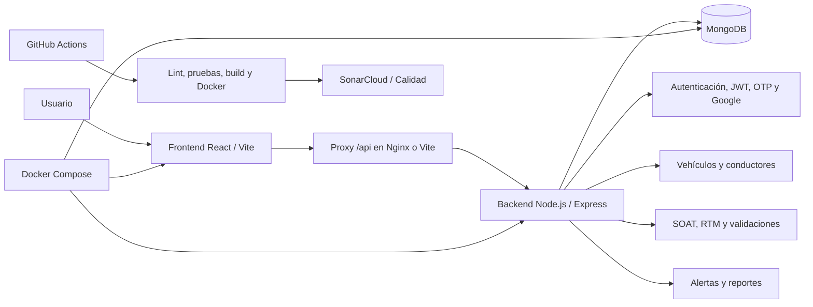

---

## 🐳 Ejecución recomendada con Docker

Docker es la forma principal recomendada para la sustentación y la validación docente.

### Requisitos previos

- Git.
- Docker Desktop o Docker Engine.
- Docker Compose.
- Acceso al repositorio.

### Clonar el repositorio

```bash
git clone https://github.com/puj-course/FIS_2610_3517_G4.git
cd FIS_2610_3517_G4
```

### Levantar el sistema

Los targets `build` y `up` existen en el `Makefile`, por lo que la ejecución principal es:

```bash
make build
make up
```

Comando equivalente con Docker Compose:

```bash
docker compose up --build -d
```

### Verificar contenedores

```bash
make ps
```

Comando equivalente:

```bash
docker compose ps
```

### Ver logs

```bash
make logs
```

Comando equivalente:

```bash
docker compose logs -f
```

### Detener el sistema

```bash
make down
```

Comando equivalente:

```bash
docker compose down --remove-orphans
```

### Puertos esperados

| Servicio | URL esperada | Descripción |
|---|---|---|
| Frontend | [http://localhost:3000](http://localhost:3000) | Interfaz web servida por el contenedor frontend. |
| Backend | [http://localhost:5000](http://localhost:5000) | Puerto expuesto de la API principal; las rutas funcionales viven bajo `/api`. |
| Healthcheck DB | [http://localhost:5000/api/health/db](http://localhost:5000/api/health/db) | Validación directa de conexión entre backend y base de datos. |
| Proxy API desde frontend | [http://localhost:3000/api/health/db](http://localhost:3000/api/health/db) | Validación del proxy `/api` configurado en Nginx para el frontend Docker. |

---

## 🔐 Variables de entorno para validación académica

El proyecto utiliza variables de entorno para configurar backend, frontend, base de datos y servicios externos.

Para esta entrega académica, los archivos `.env` se conservan dentro del repositorio con el fin de permitir la validación funcional por parte del docente. Estos archivos contienen la configuración necesaria para levantar el sistema en el entorno de evaluación y no deben moverse, eliminarse ni reemplazarse durante la revisión.

No se copia el contenido de los archivos `.env` en este README por orden y control documental. Durante la validación, el evaluador debe conservar la estructura de archivos existente para que `make build`, `make up` y Docker Compose puedan resolver la configuración preparada.

---

## 💻 Ejecución local opcional

La ejecución local sin Docker es opcional. Para la sustentación se recomienda usar Docker, porque reduce diferencias entre entornos.

### Instalación de dependencias

```bash
npm install
npm --prefix apps/web install
npm --prefix backend install
```

### Desarrollo

El script `dev` del frontend ejecuta frontend y backend en paralelo:

```bash
npm --prefix apps/web run dev
```

También se pueden ejecutar por separado:

```bash
npm --prefix apps/web run dev:frontend
npm --prefix backend start
```

### Build y vista previa

```bash
npm --prefix apps/web run build
npm --prefix apps/web run start
```

---

## 🎬 Guía rápida de demostración funcional

| Paso | Acción | Resultado esperado |
|---:|---|---|
| 1 | Levantar el sistema con `make build` y `make up`. | Los contenedores de MongoDB, backend y frontend quedan activos. |
| 2 | Verificar contenedores con `make ps`. | Los servicios aparecen en ejecución y con puertos publicados. |
| 3 | Abrir [http://localhost:3000](http://localhost:3000). | Se visualiza la interfaz web del sistema. |
| 4 | Registrar un usuario o iniciar sesión. | El usuario accede a las rutas protegidas. |
| 5 | Acceder al dashboard. | Se muestran indicadores, accesos rápidos y alertas recientes. |
| 6 | Registrar o consultar vehículos. | La flota se lista y permite operaciones CRUD. |
| 7 | Registrar o consultar conductores. | La lista de conductores muestra datos y estado de licencia. |
| 8 | Gestionar documentos vehiculares. | Se pueden registrar y consultar SOAT y RTM. |
| 9 | Revisar alertas preventivas. | El centro de alertas consolida vencimientos y estados críticos. |
| 10 | Ejecutar validación RUNT simulada. | La consulta por placa o VIN devuelve resultado simulado y puede guardarse. |
| 11 | Revisar reportes o métricas. | Se muestran indicadores operativos y opciones de reporte. |
| 12 | Validar healthcheck del backend. | `http://localhost:5000/api/health/db` responde correctamente. |
| 13 | Mostrar evidencias de pruebas. | Se revisan capturas y comandos de pruebas frontend/backend. |
| 14 | Mostrar documentación técnica y patrones. | Se enlazan arquitectura, QA, evidencias y patrones aplicados. |

---

## 🧩 Patrones de diseño aplicados

| Patrón | Tipo | Ubicación en el código | Uso dentro del sistema |
|---|---|---|---|
| Singleton | Creacional | `apps/web/src/patterns/singleton/AlertHubSingleton.js` | Mantiene una instancia única del hub de alertas para fusionar fuentes y entregar una lista consolidada. Lo consumen `apps/web/src/hooks/useAlertHub.js` y `apps/web/src/hooks/useAlertsFacade.js`. |
| Observer | Comportamental | `apps/web/src/patterns/singleton/AlertHubSingleton.js`, `apps/web/src/hooks/useAlertHub.js` | Permite que la UI se suscriba a cambios del hub y reciba actualizaciones cuando cambian las alertas. |
| Adapter | Estructural | `apps/web/src/patterns/adapters/` | Convierte SOAT, RTM, conductores y vehículos a un contrato común de alerta. Lo consume `apps/web/src/hooks/useAlertsFacade.js`. |
| Factory Method | Creacional | `apps/web/src/patterns/factory/`, `apps/web/src/components/ModalFactory.jsx` | Crea modales de autenticación y flota según el tipo solicitado, sin acoplar cada página a componentes concretos. |
| Strategy | Comportamental | `apps/web/src/patterns/strategy/` | Permite cambiar el criterio de ordenamiento de alertas por prioridad o urgencia sin modificar el hub. |
| Facade | Estructural | `apps/web/src/hooks/useAlertsFacade.js` | Oculta la coordinación entre datos de vehículos, conductores, SOAT, RTM, adapters, strategy y singleton para entregar alertas listas a las vistas. |

---

## 🧪 Pruebas y calidad

| Validación | Comando | Resultado esperado |
|---|---|---|
| Pruebas completas desde la raíz | `npm test` | Ejecuta pruebas backend y frontend. |
| Lint frontend desde la raíz | `npm run lint` | ESLint finaliza sin errores. |
| Build frontend desde la raíz | `npm run build` | Se genera build de producción en `dist/apps/web`. |
| Pruebas frontend | `npm --prefix apps/web test` | Vitest ejecuta pruebas con cobertura. |
| Lint frontend | `npm --prefix apps/web run lint` | Revisión estática del frontend sin errores. |
| Métricas propias | `npm --prefix apps/web run quality:metrics` | Se genera evidencia de métricas de calidad del sistema. |
| Build frontend | `npm --prefix apps/web run build` | Vite construye la aplicación. |
| Pruebas backend | `npm --prefix backend test` | Node test runner ejecuta pruebas de autenticación, cambio de correo y SMS. |
| Preflight de autenticación | `npm --prefix backend run doctor:auth:ci` | Valida configuración de autenticación para CI sin conectarse a servicios reales. |

Rutas de pruebas verificadas:

- `apps/web/src/__tests__/`
- `apps/web/src/test/`
- `backend/test/`

---

## ⚙️ CI/CD y DevOps

| Workflow | Archivo | Propósito |
|---|---|---|
| Entrega CI - Verificación del proyecto | [`.github/workflows/ci_verificacion.yml`](.github/workflows/ci_verificacion.yml) | Ejecuta instalación, lint y pruebas del frontend en pushes y pull requests. |
| Docker CI/CD | [`.github/workflows/docker_ci_cd.yml`](.github/workflows/docker_ci_cd.yml) | Valida frontend, backend, auditorías, Docker Compose, healthchecks y build de imágenes. |
| SonarCloud Analysis | [`.github/workflows/sonarcloud.yml`](.github/workflows/sonarcloud.yml) | Ejecuta lint, auditoría, pruebas con cobertura, build y análisis SonarCloud. |
| CD - Generación de Artefacto y Entrega Continua | [`.github/workflows/cd_entrega.yml`](.github/workflows/cd_entrega.yml) | Construye el frontend y guarda un artefacto de producción. |
| HU-454 - Pipeline CI/CD Autenticacion | [`.github/workflows/pipeline_hu454_auth_ci_cd.yml`](.github/workflows/pipeline_hu454_auth_ci_cd.yml) | Valida frontend, backend y preflight de autenticación. |
| Notificar Discord | [`.github/workflows/notify_discord.yml`](.github/workflows/notify_discord.yml) | Workflow reutilizable para notificar resultados de pipelines. |
| Kanban 1 - Flujo y Asignación Dinámica | [`.github/workflows/Flujo y asignación dinámica.yml`](<.github/workflows/Flujo y asignación dinámica.yml>) | Automatiza asignación y comentario inicial en issues. |
| Kanban 2 - Estándares de Calidad | [`.github/workflows/Estándares_de_calidad.yml`](<.github/workflows/Estándares_de_calidad.yml>) | Inserta criterios INVEST y Definition of Done en nuevas tareas. |

Elementos DevOps del proyecto:

- `docker-compose.yml` levanta MongoDB, backend y frontend.
- `Dockerfile` construye la imagen del backend.
- `apps/web/Dockerfile` construye el frontend y lo sirve con Nginx.
- `apps/web/nginx.conf` configura el proxy `/api` hacia el backend.
- `sonar-project.properties` configura fuentes, pruebas, cobertura y exclusiones para SonarCloud.

---

## 📁 Estructura del proyecto

```text
.
├── apps/
│   └── web/
├── backend/
├── conf/
├── docs/
├── scripts/
├── wireframe_soat/
├── .github/
│   └── workflows/
├── Dockerfile
├── Makefile
├── docker-compose.yml
├── docker-compose.prod.yml
├── package.json
├── sonar-project.properties
└── README.md
```

| Ruta | Descripción |
|---|---|
| `apps/web/` | Frontend React/Vite, componentes, páginas, hooks, contextos, servicios, pruebas y Dockerfile del frontend. |
| `backend/` | API Node.js/Express, modelos, servicios, scripts y pruebas backend. |
| `docs/` | Documentación académica, arquitectura, QA, Agile, evidencias e informe final. |
| `.github/workflows/` | Workflows de CI, CD, Docker, SonarCloud y automatizaciones de gestión. |
| `Dockerfile` | Imagen del backend. |
| `apps/web/Dockerfile` | Imagen del frontend con build Vite y Nginx. |
| `docker-compose.yml` | Stack local con MongoDB, backend y frontend. |
| `Makefile` | Comandos de apoyo para construir, levantar, revisar logs, listar y detener contenedores. |
| `sonar-project.properties` | Configuración de análisis SonarCloud. |

---

## 📚 Documentación y evidencias

| Documento o carpeta | Descripción | Ruta |
|---|---|---|
| Entrega final | Guía de informe final, evidencias y validaciones. | [`docs/Entrega-Final/README.md`](docs/Entrega-Final/README.md) |
| Informe LaTeX | Fuente del informe académico final. | [`docs/Entrega-Final/main.tex`](docs/Entrega-Final/main.tex) |
| Informe PDF | Salida PDF del informe final. | [`docs/Entrega-Final/main.pdf`](docs/Entrega-Final/main.pdf) |
| Evidencias finales | Capturas numeradas de Agile, QA, Docker, CI/CD, SonarCloud y pruebas. | [`docs/Entrega-Final/evidencias/`](docs/Entrega-Final/evidencias/) |
| Arquitectura | Índice de documentación arquitectónica. | [`docs/Arquitectura/README.md`](docs/Arquitectura/README.md) |
| Patrones GoF | Matriz de patrones aplicados. | [`docs/Arquitectura/patrones/matriz_patrones_gof.md`](docs/Arquitectura/patrones/matriz_patrones_gof.md) |
| Modelo de base de datos | Descripción de la base de datos del sistema. | [`docs/DiagramaDB/syntix_tech_db_descripcion.md`](docs/DiagramaDB/syntix_tech_db_descripcion.md) |
| Sustentación 5.0 | Índice de evidencias QA para sustentación. | [`docs/QA/evidencias_finales/00_indice_sustentacion_5.md`](docs/QA/evidencias_finales/00_indice_sustentacion_5.md) |
| Pruebas y cobertura | Evidencia de pruebas unitarias y coverage. | [`docs/QA/evidencias_finales/pruebas/03_pruebas_unitarias_coverage.md`](docs/QA/evidencias_finales/pruebas/03_pruebas_unitarias_coverage.md) |
| Docker y CI/CD | Evidencia de despliegue Docker y pipelines. | [`docs/QA/evidencias_finales/docker/04_despliegue_docker_ci_cd.md`](docs/QA/evidencias_finales/docker/04_despliegue_docker_ci_cd.md) |
| SonarCloud | Evidencia de métricas de calidad. | [`docs/QA/evidencias_finales/sonar/02_sonarcloud.md`](docs/QA/evidencias_finales/sonar/02_sonarcloud.md) |
| SMS/Twilio | Evidencia de integración SMS y pruebas. | [`docs/QA/evidencias_finales/sms/05_integracion_sms_twilio.md`](docs/QA/evidencias_finales/sms/05_integracion_sms_twilio.md) |
| Guion de sustentación | Guía de exposición del equipo. | [`docs/QA/evidencias_finales/sustentacion/10_guion_sustentacion.md`](docs/QA/evidencias_finales/sustentacion/10_guion_sustentacion.md) |
| Trabajo en equipo | Evidencia de roles y aportes. | [`docs/QA/evidencias_finales/trabajo_equipo/09_trabajo_equipo.md`](docs/QA/evidencias_finales/trabajo_equipo/09_trabajo_equipo.md) |
| Agile | Reporte final de sprints y postmortem. | [`docs/Agile/reporte_final_sprints.md`](docs/Agile/reporte_final_sprints.md) |
| Gestión de datos | Descripción de exportación, importación y validaciones operativas. | [`docs/data-management.md`](docs/data-management.md) |
| Entorno | Guía de variables y ejecución local. | [`docs/environment.md`](docs/environment.md) |

---

## 🖼️ Evidencias visuales del sistema

### Landing pública

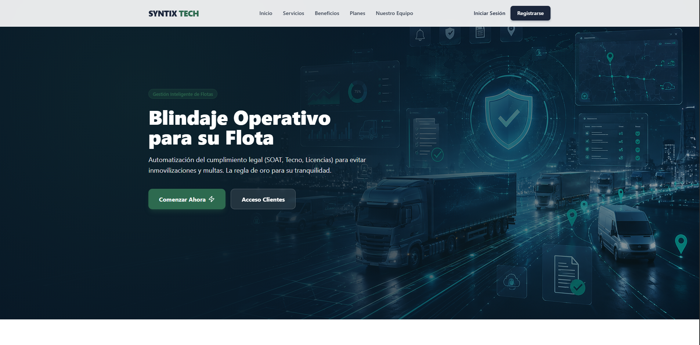

### Dashboard operativo

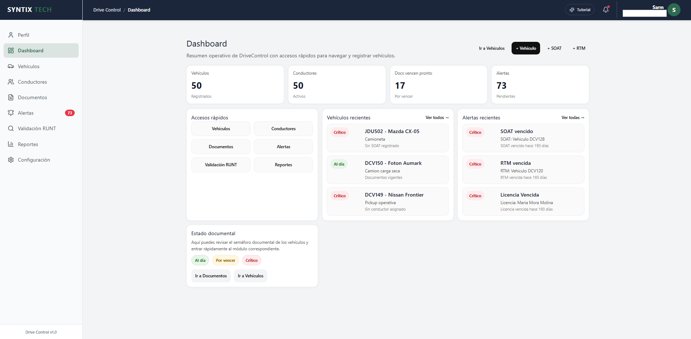

### Gestión de vehículos

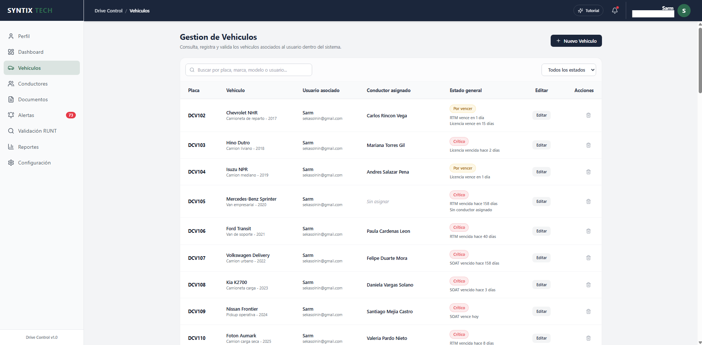

### Reportes y analítica

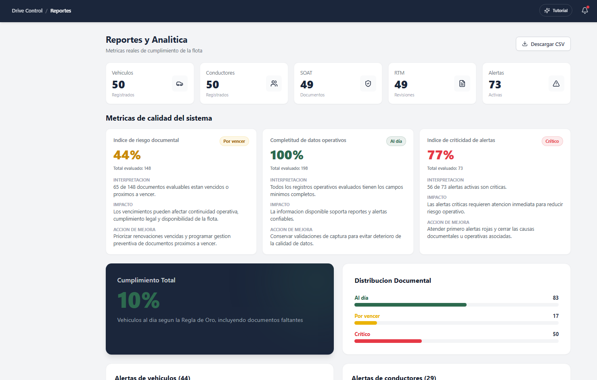

### Métricas de calidad

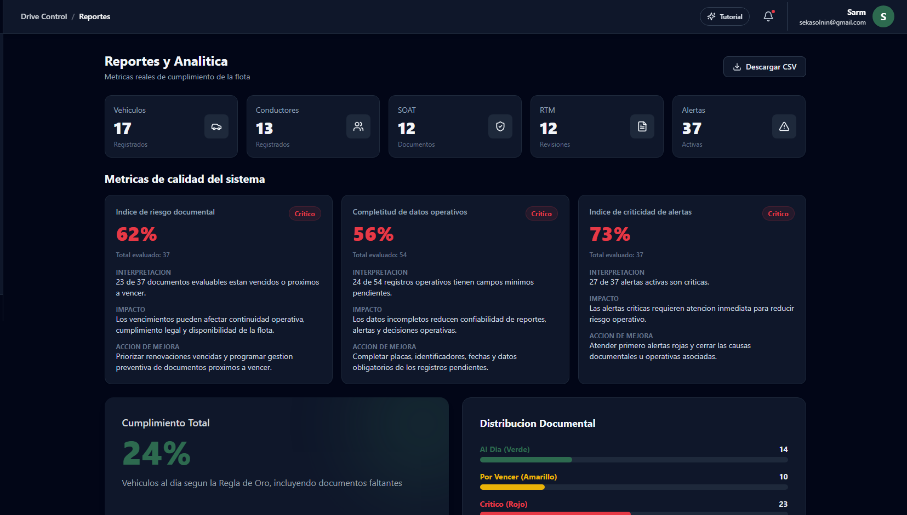

### Autenticación

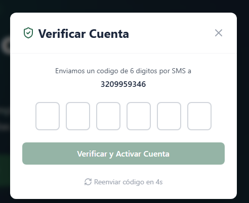

### Docker y despliegue

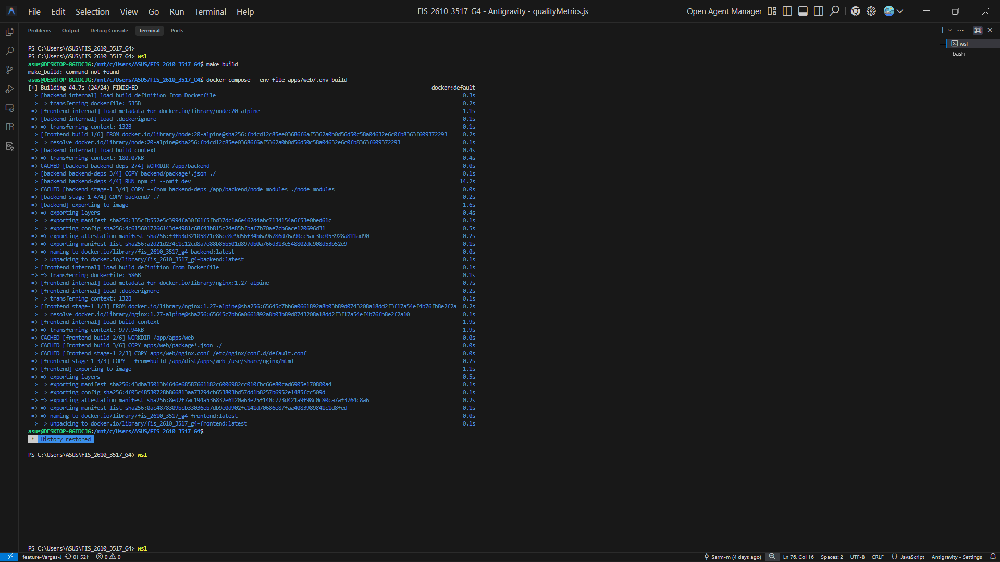

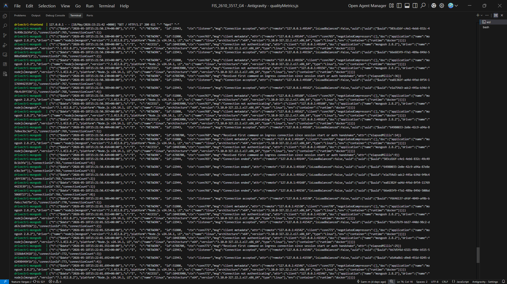

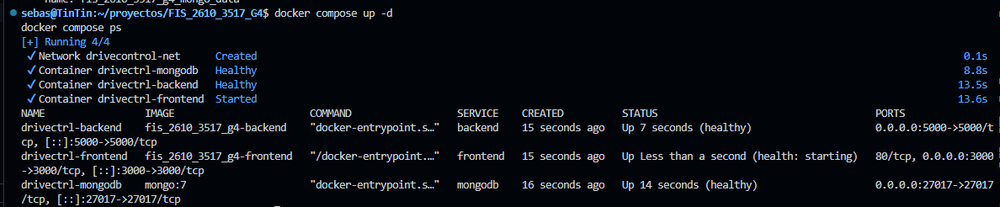

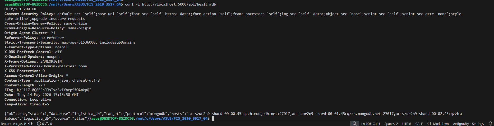

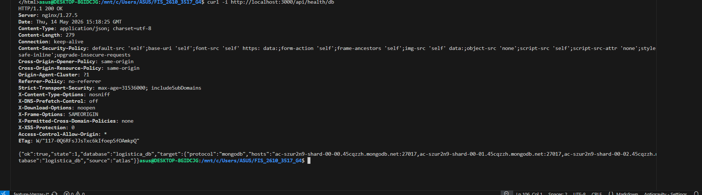

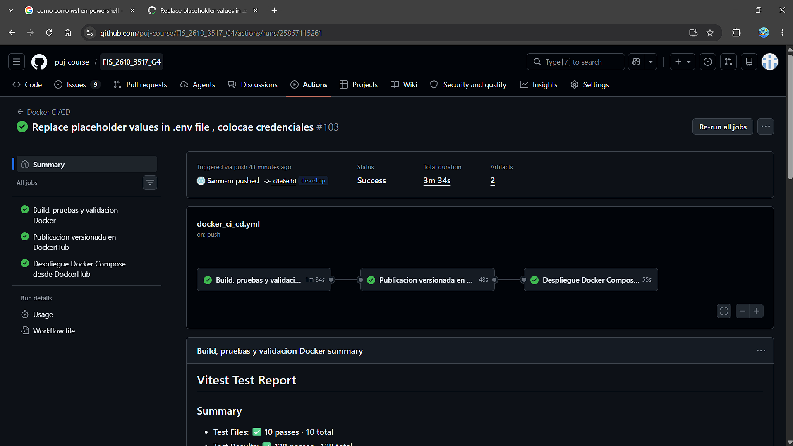

### Pruebas y calidad

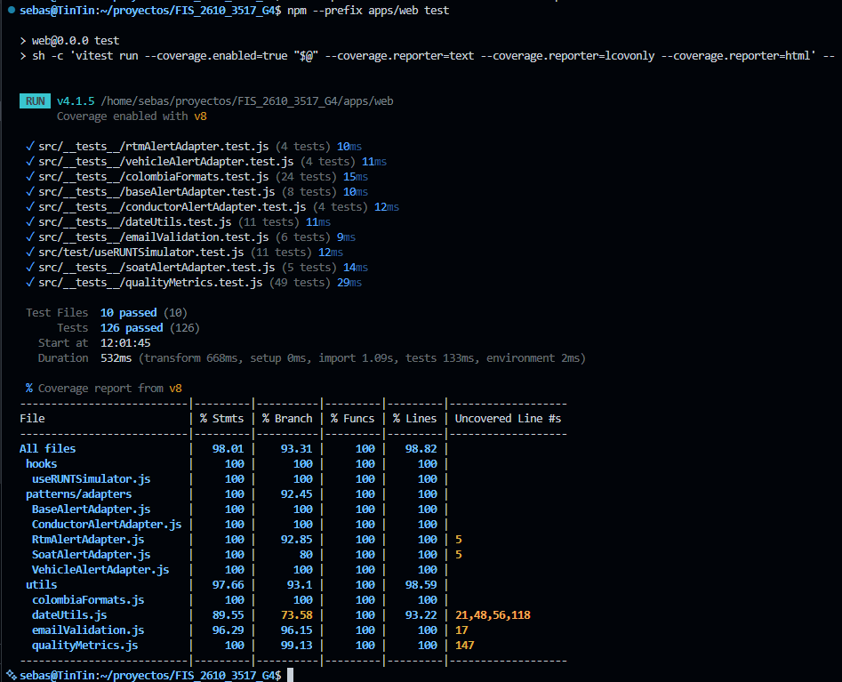

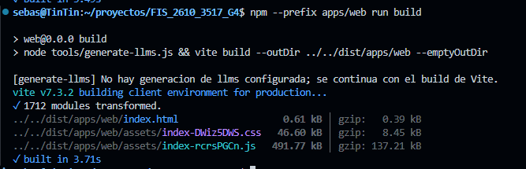

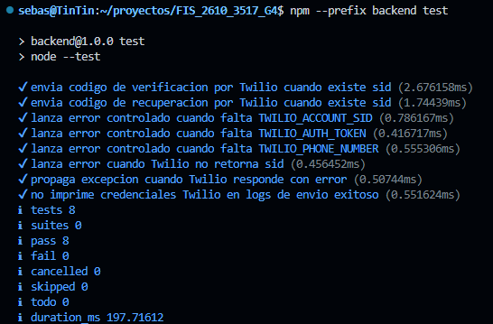

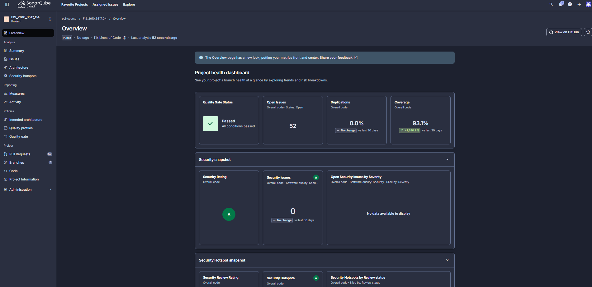

### Arquitectura y datos

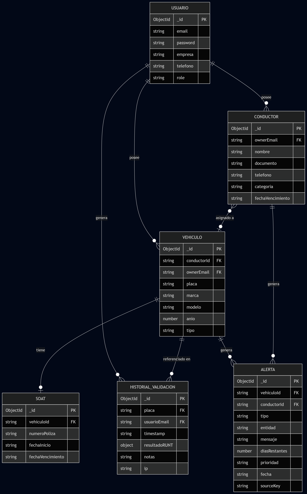


---

## 🏁 Estado final del proyecto

DriveControl / AutoMinder Enterprise queda preparado para validación funcional, sustentación, revisión de arquitectura, revisión de pruebas, revisión de documentación y ejecución mediante Docker. El README principal consolida la guía de operación, evidencias, comandos, patrones, DevOps y criterios de verificación necesarios para la entrega final académica.
