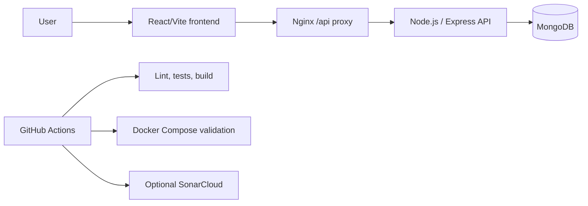

# DriveControl

DriveControl is a web platform for fleet document compliance. It helps operations teams centralize vehicles, drivers, SOAT, RTM, validation history, alerts, and account workflows in one place so they can act before documents expire.

## Value Proposition

Fleet teams often manage documents across spreadsheets, chats, and manual reminders. DriveControl turns that scattered work into a clear operational dashboard with status signals, document records, recovery flows, and quality checks that can be run locally or in CI.

## Problem

Small and mid-sized fleet operations can lose visibility over:

- Upcoming SOAT and RTM expirations.
- Driver and vehicle assignment records.
- Evidence for validation and audit trails.
- Authentication and notification flows.
- Repeatable deployment and quality verification.

## Solution

DriveControl combines a React/Vite frontend, a Node.js/Express API, and MongoDB persistence. Docker Compose starts the full stack locally with an internal MongoDB service, while GitHub Actions validates frontend quality, backend tests, Docker health checks, optional DockerHub publishing, optional SonarCloud analysis, and optional Discord notifications.

## Key Features

- Fleet dashboard with operational document status.
- Vehicle, driver, SOAT, RTM, and validation history management.
- Email and SMS-oriented OTP flows for registration, recovery, and email change.
- API health checks for backend and database status.
- Dockerized frontend, backend, and MongoDB services.
- Frontend unit tests with coverage output for quality reporting.
- Backend Node test suite and syntax validation.

## Architecture



The Docker frontend serves the Vite build through Nginx on port `3000`. API requests under `/api` are proxied to the backend on port `5000`. In local Docker and CI, the backend uses `mongodb://mongodb:27017/logistica_db` by default.

## Tech Stack

- Frontend: React 18, Vite, Tailwind CSS, Vitest.
- Backend: Node.js 20, Express, Mongoose, Node test runner.
- Database: MongoDB 7.
- Runtime: Docker, Docker Compose, Nginx.
- Quality: ESLint, Vitest coverage, SonarCloud when configured.
- CI/CD: GitHub Actions.

## Quick Start With Docker

```sh
docker compose config
docker compose up -d --build
curl --fail http://localhost:5000/api/health/db
curl --fail http://localhost:3000/
curl --fail http://localhost:3000/api/health/db
docker compose down -v
```

Expected local endpoints:

- Frontend: `http://localhost:3000/`
- Backend DB health: `http://localhost:5000/api/health/db`
- Frontend API proxy health: `http://localhost:3000/api/health/db`

## Local Development

Install dependencies:

```sh
npm --prefix apps/web ci
npm --prefix backend ci
```

Run frontend and backend locally:

```sh
npm --prefix apps/web run dev
```

For non-Docker backend development, copy `backend/.env.example` to `backend/.env` and keep real values untracked.

## Environment Variables

Backend variables belong in the process environment, `backend/.env`, or root `.env`. The backend does not load `apps/web/.env` for secrets.

Frontend variables must use the `VITE_*` prefix because Vite exposes them to browser code:

- `VITE_API_URL`
- `VITE_GOOGLE_CLIENT_ID`
- `VITE_ENABLE_LOCAL_AUTH_FALLBACK`

See [docs/security/secrets-and-ci.md](docs/security/secrets-and-ci.md) for the complete placeholder list, GitHub Actions configuration, and rotation guidance.

## Data Persistence

Fleet entities are stored through the backend API in MongoDB and scoped by the authenticated user's `ownerEmail`. Vehicles, conductors, SOAT records, RTM records, and RUNT validation history are loaded from API endpoints after login; browser storage is reserved for session, theme, preferences, or the explicit development-only auth fallback.

Use [docs/testing/persistence-check.md](docs/testing/persistence-check.md) to manually verify local Docker persistence.

## Testing And Quality

```sh
npm --prefix apps/web run lint
npm --prefix apps/web test
npm --prefix apps/web run build
npm --prefix backend test
node --check backend/server.js
npm run secrets:check
```

The frontend test command writes coverage to `apps/web/coverage/lcov.info`, which the SonarCloud workflow can consume when SonarCloud is configured.

## CI/CD

Workflows live in `.github/workflows/`.

- `docker_ci_cd.yml`: runs frontend/backend validation, Docker Compose config, container build, stack startup, and health checks.
- `sonarcloud.yml`: runs frontend quality checks and optionally runs SonarCloud.
- `cd_entrega.yml`: builds and uploads the frontend artifact.
- `notify_discord.yml`: reusable optional Discord notification workflow.
- `pipeline_hu454_auth_ci_cd.yml`: authentication-focused validation and optional deploy hooks.
- `quality_standards.yml` and `kanban_flow_assignment.yml`: issue workflow helpers.

Optional integrations skip with a GitHub notice when credentials are not configured. They should not fail the main validation path.

## SonarCloud Setup

Create or import the personal repository project in SonarCloud, then configure:

- Secret: `SONAR_TOKEN`
- Repository variable: `SONAR_ORGANIZATION`
- Repository variable: `SONAR_PROJECT_KEY`

`sonar-project.properties` keeps source, test, exclusion, and coverage settings. Organization and project key are passed by the workflow so the repository is not tied to the previous academic organization.

## Security Notes

Real credentials must not be committed. The repo ignores `.env` files and the private credential appendix. If any real credential has already reached GitHub history, rotate it in MongoDB Atlas, Gmail/App Passwords, Twilio, Google OAuth, DockerHub, Discord, and any deploy provider before continuing development.

## Roadmap

- Harden production deployment configuration after the personal repository is fully configured.
- Add dedicated backend coverage reporting.
- Expand API contract tests around fleet and document workflows.
- Document production observability and backup procedures.

## Documentation

- [Secrets and CI configuration](docs/security/secrets-and-ci.md)
- [Environment guide](docs/environment.md)
- [Architecture index](docs/Arquitectura/README.md)
- [Database description](docs/DiagramaDB/syntix_tech_db_descripcion.md)
- [Final QA evidence index](docs/QA/evidencias_finales/00_indice_sustentacion_5.md)

## Team And Academic Origin

DriveControl was created by SYNTIX TECH as an academic software engineering project. The repository keeps the course documentation and evidence under `docs/`, while the current personal fork is prepared for continued product-oriented development.
